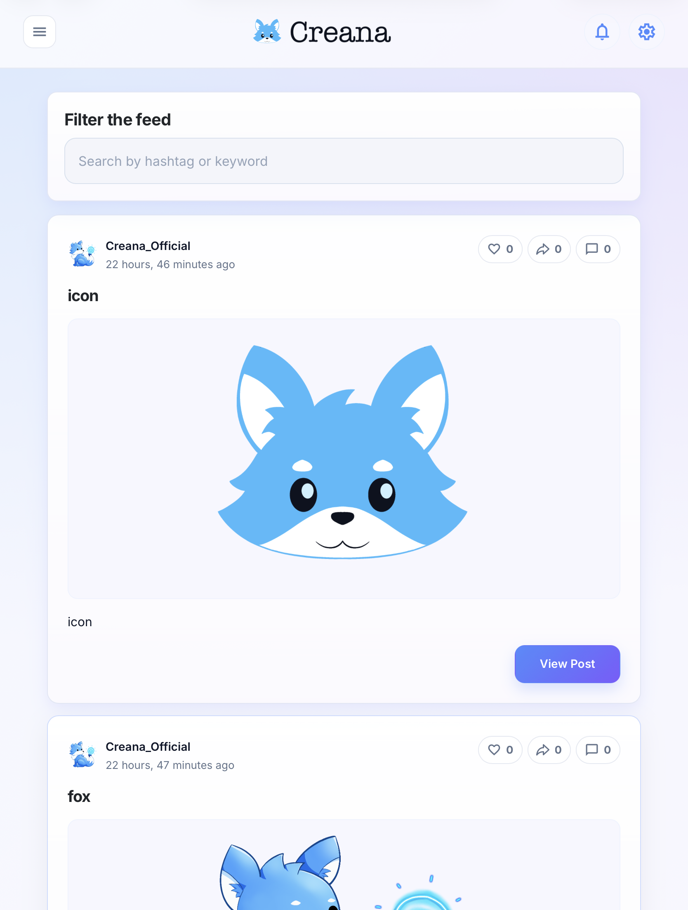
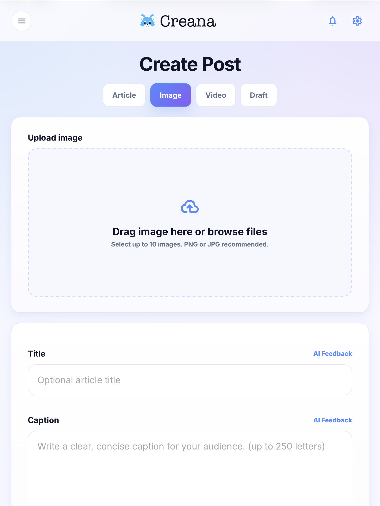
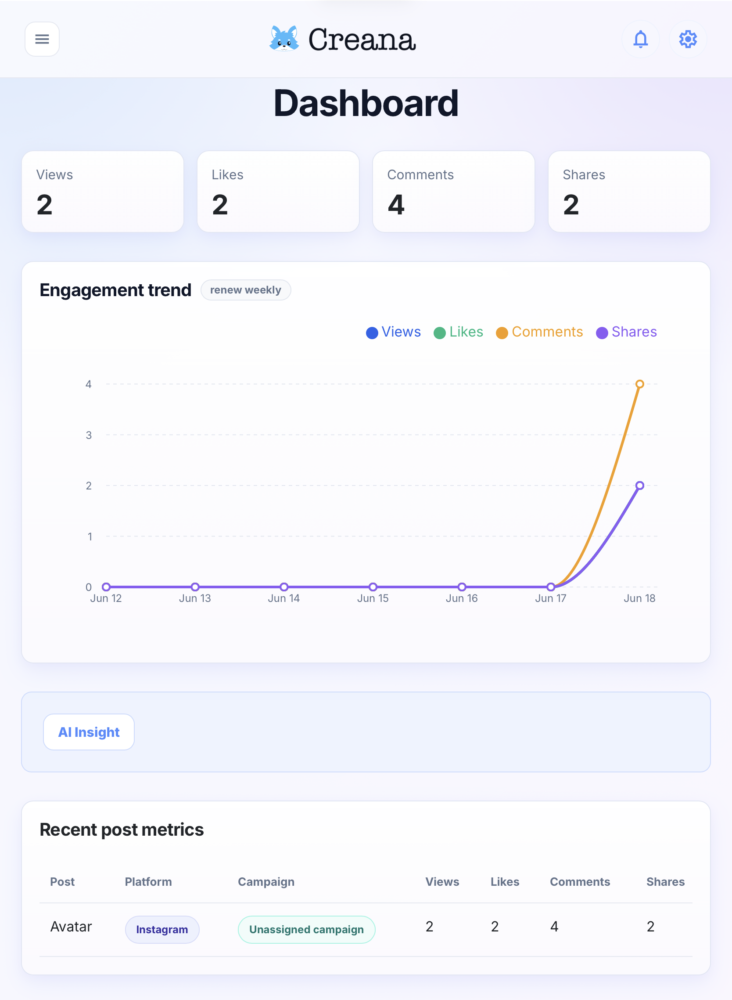
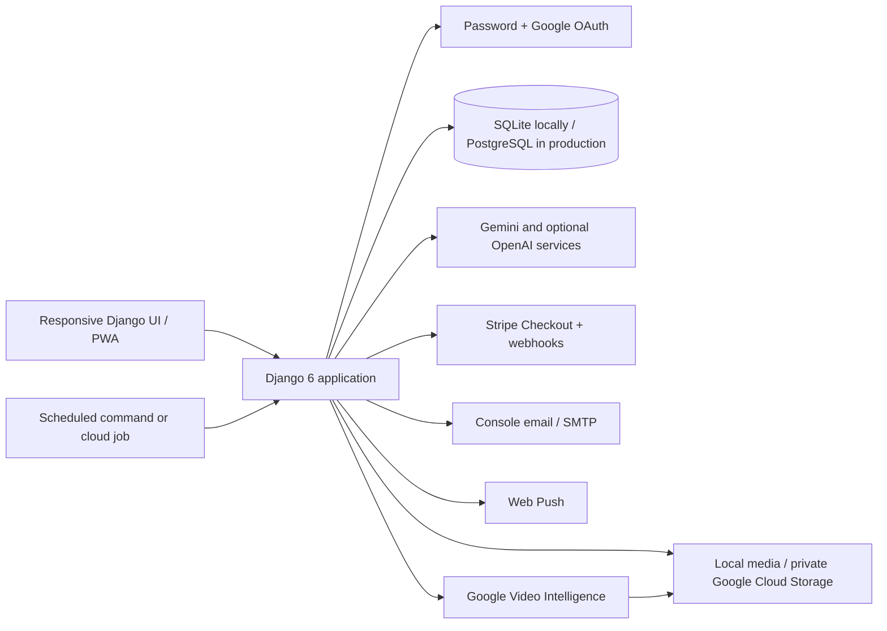

# Creana

**An AI-powered social media workspace for turning ideas and media into publish-ready content, then learning from real engagement.**

Creana was built for the OpenAI Build Week Hackathon. It combines campaign planning, multimodal content creation, scheduling, community features, and first-party analytics in one responsive Django application. Its AI workflows can draft titles, captions, hashtags, and articles from text, images, or video, while the analytics agent turns post and video performance data into practical recommendations.

[Live demo](https://creana.app) · [Source repository](https://github.com/Loic0927/Creana)

> The hosted demo depends on external cloud services and may be unavailable after the judging period. No public demo credentials are stored in this repository.

## What Creana Does

- Creates image, carousel, article, and video posts inside campaigns.
- Uses an AI Post Agent to generate selected fields such as titles, captions, hashtags, and article copy.
- Accepts text and media context for multimodal content generation.
- Schedules posts and publishes due records through a Django management command.
- Provides a feed with profiles, follows, likes, shares, threaded comments, and notifications.
- Tracks first-party views, engagement, watch sessions, retention events, and historical performance snapshots.
- Surfaces dashboard, campaign, post, and video-retention insights.
- Supports Google sign-in, password authentication, membership checkout, email, and web push when configured.
- Runs in English and Traditional Chinese with a responsive, installable PWA interface.

## Hackathon Overview

Social content teams often jump between a writing tool, a scheduler, social networks, and analytics dashboards. Creana brings that workflow into one place:

1. Add an idea, target audience, goals, and optional image or video context.
2. Ask the AI agent to generate only the content fields you need.
3. Review and edit the result before saving or scheduling it.
4. Publish into Creana's internal social feed.
5. Inspect engagement, video retention, and AI-assisted recommendations.

The current analytics are based on activity recorded inside Creana. The application does **not** claim to publish to, or import live metrics from, Instagram, TikTok, X, Reddit, YouTube, or other external social platforms.

## Demo

### Suggested judging flow

1. Create an account or sign in.
2. Create a campaign from **Campaigns**.
3. Open **Create Post**, select a post type, and add text or media.
4. Use the AI Post Agent to generate a caption, title, hashtags, or article content.
5. Review the generated fields, then publish or schedule the post.
6. Interact with the post in the feed.
7. Open **Dashboard**, **Post Analytics**, or the video analysis view to inspect performance and retention.

### Screenshots

| Feed | Create post | Analytics dashboard |
| --- | --- | --- |
|  |  |  |

## Architecture



### Technology stack

| Layer | Technology |
| --- | --- |
| Backend | Python 3.12, Django 6, Gunicorn |
| Frontend | Django templates, HTML, CSS, vanilla JavaScript, PWA service worker |
| Data | SQLite for local development; PostgreSQL through `DATABASE_URL` in production |
| AI | OpenAI API for the optional Post Agent; Gemini for configured AI analysis/generation flows; Google Cloud Video Intelligence for GCS-hosted video analysis |
| Media | Local filesystem or private Google Cloud Storage with signed URLs |
| Authentication | Django authentication and `django-allauth` Google OAuth |
| Payments | Stripe Checkout and signed webhooks |
| Deployment | Docker, Google Cloud Run, Cloud SQL, GCS, Secret Manager |

## Key Technical Decisions

- **Django monolith:** models, authenticated workflows, templates, and API-like endpoints stay in one deployable application, which kept the hackathon feedback loop fast.
- **Human review before save:** AI output populates editable form fields; it is not published automatically.
- **Provider boundary:** `AI_PROVIDER` selects the Post Agent provider. The current OpenAI Post Agent is explicitly enabled with `OPENAI_AGENT_ENABLED`; existing Gemini features keep their own settings.
- **First-party analytics:** views, likes, comments, shares, watch sessions, retention events, and snapshots are stored by Creana, producing reproducible demo analytics without third-party social API access.
- **Cached AI suggestions:** `AISuggestionHistory` avoids unnecessary repeated analysis; user-triggered refresh paths can request a new result where supported.
- **Graceful degradation:** rule-based analytics summaries remain available in supported views when an external AI service is not configured or cannot respond.
- **Portable storage and database configuration:** local development needs no managed services, while production switches to PostgreSQL and GCS through environment variables.

## Local Setup

### Prerequisites

- Python 3.12 or a compatible Python version supported by the pinned dependencies
- Git
- `ffmpeg` for video metadata and thumbnail features

All commands below run from this repository directory (the folder containing `manage.py`).

### Windows PowerShell

```powershell
git clone https://github.com/Loic0927/Creana.git
cd Creana
python -m venv venv
.\venv\Scripts\Activate.ps1
python -m pip install --upgrade pip
python -m pip install -r requirements.txt
Copy-Item .env.example .env
python manage.py migrate
python manage.py check
python manage.py runserver
```

### macOS or Linux

```bash
git clone https://github.com/Loic0927/Creana.git
cd Creana
python3 -m venv venv
source venv/bin/activate
python -m pip install --upgrade pip
python -m pip install -r requirements.txt
cp .env.example .env
python manage.py migrate
python manage.py check
python manage.py runserver
```

Open <http://127.0.0.1:8000/>. With the example configuration, Creana uses SQLite, local media storage, and console email. AI, OAuth, Stripe, SMTP, GCS, and web push are optional for basic local use.

To create a local administrator:

```bash
python manage.py createsuperuser
```

Never publish administrator or demo passwords in documentation or source control.

## Environment Variables

Copy `.env.example` to `.env`, then change only the services you intend to use. Django loads `.env` without overriding real process environment variables. Do not commit `.env`.

### Core application

| Variable | Required | Purpose |
| --- | --- | --- |
| `SECRET_KEY` | Production | Django signing secret; replace the local placeholder when `DEBUG=False` |
| `DEBUG` | No | Enables local debug behavior; defaults to `False` |
| `ALLOWED_HOSTS` | Production | Comma-separated Django host names |
| `CSRF_TRUSTED_ORIGINS` | Production | Comma-separated full HTTPS origins |
| `SITE_URL` | Recommended | Canonical base URL, Stripe redirects, and SEO metadata |
| `DATABASE_URL` | Production | PostgreSQL URL; blank uses local SQLite |
| `DATABASE_CONN_MAX_AGE` | No | Persistent DB connection lifetime in seconds |

### AI and video

| Variable | Required | Purpose |
| --- | --- | --- |
| `AI_PROVIDER` | No | Post Agent provider; current supported agent value is `openai` |
| `OPENAI_AGENT_ENABLED` | OpenAI agent | Explicit feature flag for the OpenAI Post Agent |
| `OPENAI_AGENT_MODEL` | OpenAI agent | Runtime OpenAI model name; no model is hardcoded by the README |
| `OPENAI_API_KEY` | OpenAI agent | OpenAI API credential (`LLM_API_KEY` is accepted as a fallback) |
| `GEMINI_API_KEY` | Gemini features | Google Gemini credential |
| `GEMINI_ENABLED` | No | Enables configured Gemini flows |
| `GEMINI_MODEL` | No | Gemini runtime model; example default is `gemini-2.5-flash` |
| `GEMINI_VIDEO_MAX_BYTES` | No | Maximum video size sent to Gemini |
| `GEMINI_VIDEO_MAX_SECONDS` | No | Maximum video duration sent to Gemini |
| `VIDEO_MAX_DURATION_SECONDS` | No | Application video-duration limit |
| `VIDEO_INTELLIGENCE_TIMEOUT_SECONDS` | No | Google Video Intelligence timeout |

### Storage and uploads

| Variable | Required | Purpose |
| --- | --- | --- |
| `USE_GCS` | No | Use Google Cloud Storage instead of local files |
| `GS_BUCKET_NAME` / `GS_MEDIA_BUCKET_NAME` | When using GCS | Default or media bucket name |
| `GS_QUERYSTRING_AUTH` | No | Use signed private-media URLs |
| `GS_IAM_SIGN_BLOB` / `GS_SA_EMAIL` | Cloud Run signed URLs | IAM-based URL signing configuration |
| `VIDEO_UPLOAD_MAX_BYTES` | No | Direct-upload size limit |
| `VIDEO_FORM_UPLOAD_MAX_BYTES` | No | Django form-upload fallback limit; `0` is unlimited locally |

### Integrations

| Variables | Required for |
| --- | --- |
| `GOOGLE_CLIENT_ID`, `GOOGLE_CLIENT_SECRET` | Google OAuth |
| `STRIPE_SECRET_KEY`, `STRIPE_PUBLISHABLE_KEY`, `STRIPE_MEMBERSHIP_PRICE_ID`, `STRIPE_WEBHOOK_SECRET` | Paid membership checkout and webhooks |
| `EMAIL_BACKEND`, `EMAIL_HOST`, `EMAIL_PORT`, `EMAIL_USE_TLS`, `EMAIL_HOST_USER`, `EMAIL_HOST_PASSWORD`, `DEFAULT_FROM_EMAIL`, `SERVER_EMAIL` | SMTP email; console email works locally |
| `WEB_PUSH_VAPID_PUBLIC_KEY`, `WEB_PUSH_VAPID_PRIVATE_KEY`, `WEB_PUSH_VAPID_EMAIL` | Browser push notifications |
| `INDEXNOW_KEY`, `INDEXNOW_ENDPOINT` | Optional IndexNow configuration |

Generate VAPID values with:

```bash
python manage.py generate_vapid_keys
```

The complete safe template is in [`.env.example`](.env.example). Keep API keys, private keys, database passwords, OAuth secrets, and Stripe secrets in environment variables or a secret manager.

## Scheduled Publishing and Maintenance

Creana stores future posts with a scheduled status. Run this command periodically (for example, from cron or a Cloud Run Job):

```bash
python manage.py publish_scheduled_posts
```

Useful maintenance commands include:

```bash
python manage.py generate_post_thumbnails
python manage.py generate_video_thumbnails
python manage.py generate_avatar_thumbnails
python manage.py check_openai_config
```

## Tests

Run the Django checks and full test suite with:

```bash
python manage.py check
python manage.py test
```

Focused AI tests are also available:

```bash
python manage.py test socialmanager.test_ai_post_agent socialmanager.test_ai_post_agent_backend
python manage.py test socialmanager.test_analysis_agent socialmanager.test_openai_provider
```

Tests use local or mocked behavior and should not require production credentials. Do not point test runs at a production database.

## How Codex Accelerated the Workflow

Codex acted as an engineering collaborator during Build Week. It helped inspect the existing Django codebase, connect model/view/template/JavaScript flows, implement and review the Creana AI Agent boundary, refine multimodal post creation, diagnose analytics and retention behavior, improve responsive UI details, add validation and fallbacks, run Django checks and focused tests, review migrations, and prepare submission documentation.

That support shortened the loop from idea to verified implementation. Generated changes were still reviewed against the actual code, exercised with checks or tests, and adjusted before inclusion.

## How GPT-5.6 Was Used

GPT-5.6 was used through Codex as a **development-time reasoning and coding collaborator** during the hackathon. It supported repository-wide code reasoning, implementation planning, debugging, prompt refinement, structured-output validation, UX copy, test design, and documentation.

GPT-5.6 is not presented here as Creana's production runtime model. Runtime AI behavior is selected through the environment variables above: configured Gemini flows use `GEMINI_MODEL`, while the optional OpenAI Post Agent requires `AI_PROVIDER=openai`, `OPENAI_AGENT_ENABLED=True`, and an explicit `OPENAI_AGENT_MODEL`.

## Limitations

- External social networks are represented as targeting metadata; Creana does not currently publish to their APIs or import their live analytics.
- Scheduled publishing changes Creana's internal post state and requires the management command to run periodically.
- Meaningful analytics require interactions generated within Creana or seeded test data.
- AI quality and availability depend on provider configuration, quotas, supported media limits, and network access.
- Google Video Intelligence analysis requires a video stored in GCS and valid Google Cloud credentials.
- Stripe, Google OAuth, SMTP, GCS, and web push are inactive until their credentials are configured.
- There is no standalone seed-data command. For judging, create data through the UI or use a prepared, securely managed demo environment.

## Security and Privacy

- Never commit `.env`, service-account files, tokens, database URLs, or private keys.
- User text and uploaded media may be sent to the configured AI provider when an AI feature is invoked. Deployers should disclose this, obtain appropriate consent, and follow each provider's data terms.
- Uploaded media is local by default. Production GCS media can remain private and be served through signed URLs.
- AI output is untrusted generated content and should be reviewed before publication.
- Use `DEBUG=False`, a strong `SECRET_KEY`, HTTPS hosts/origins, least-privilege cloud identities, verified Stripe webhook signatures, and a production SMTP provider in deployment.
- Production deployment details and hardening guidance are documented in [`DEPLOYMENT.md`](DEPLOYMENT.md).

## Repository and License

The repository is hosted at <https://github.com/Loic0927/Creana>. No `LICENSE` file is currently included, so the source is **not offered under an open-source license** by default. Add an explicit license before inviting reuse or distribution.

If the repository is private during hackathon judging, grant the event's required reviewer accounts access through the repository hosting platform; do not place access tokens or account passwords in this README.
